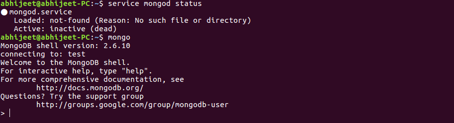
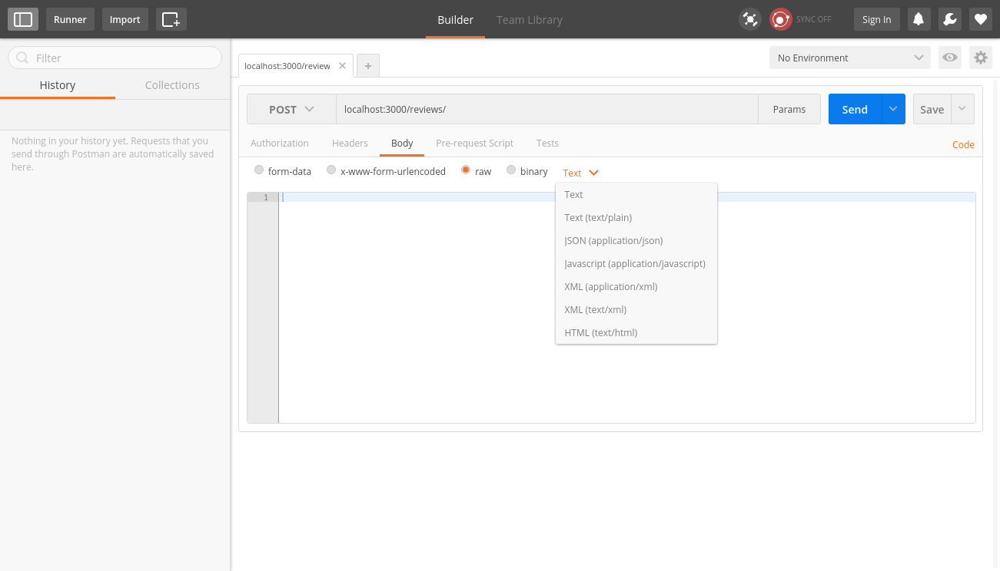
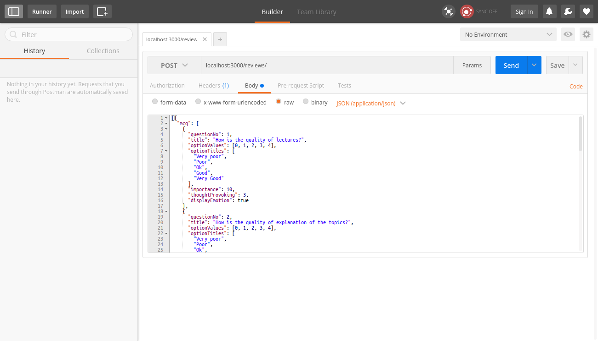
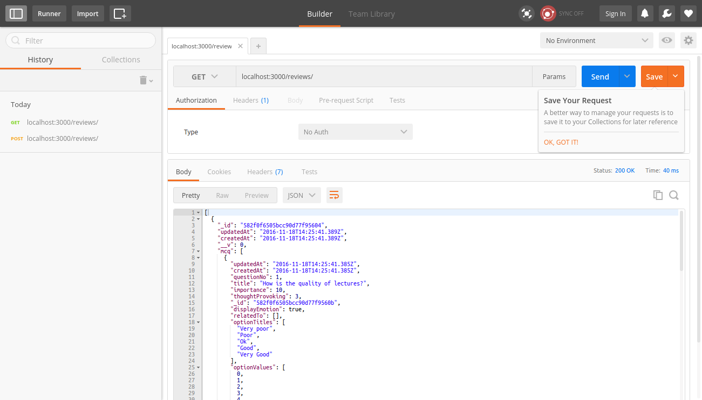
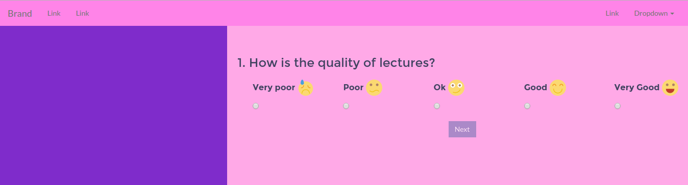

# Project setup instructions for Ubunt 14.04

### Step 1: Installing NODE.JS :

Install Nodejs by running the following commands in your terminal

```sh
sudo apt-get update
sudo apt-get install nodejs
sudo apt-get install nodejs-legacy
```

Now that nodejs is set up you can open your terminal and type:
```sh
node -v
```
The version number of your nodejs installation should be displayed

In most cases, you'll also want to also install npm, which is the Node.js package manager. You can do this by typing:

```sh
sudo apt-get install npm
```

### Step 2: Installing and Setting Up MongoDB :

MongoDB is a free and open-source NoSQL document database used commonly in modern web applications.

##### First open terminal and execute:

```sh
sudo apt-key adv --keyserver hkp://keyserver.ubuntu.com:80 --recv 7F0CEB10
```

After successfully importing the key you will see something like this:

```sh
gpg: Total number processed: 1
gpg:               imported: 1  (RSA: 1)
````


Next, we have to add the MongoDB repository details so APT will know where to download the packages from.

Issue the following command to create a list file for MongoDB.

```sh
echo "deb http://repo.mongodb.org/apt/ubuntu "$(lsb_release -sc)"/mongodb-org/3.0 multiverse" | sudo tee /etc/apt/sources.list.d/mongodb-org-3.0.list
```

After adding the repository details, we need to update the packages list.

```sh
sudo apt-get update
```

Now we can install the MongoDB package itself.

```sh
sudo apt-get install -y mongodb-org
```

A problem might occur for few users. You might see a message like:

```sh
Reading package lists... Done
Building dependency tree
Reading state information... Done
E: Unable to locate package mongodb-org
```

If this happens run:

```sh
sudo apt-get install -y mongodb
```
For more information, visit [this link](http://stackoverflow.com/questions/28945921/e-unable-to-locate-package-mongodb-org)

Now that MongoDB is set up run the following in the terminal:

```sh
service mongo status
```

You will see something like this



Then run
```sh
mongo
```

The output should be as shown above


### Step 3: Install and Download Robomongo

Robomongo is a software which will help us in interacting with our MongoDB database through a simple GUI

Download Robomongo from [here](https://download.robomongo.org/0.8.5/linux/robomongo-0.8.5-x86_64.deb)

Install this .deb file and run it

You should see a window open as shown under


Click on the **Create** option and save changes as displayed below


Click on **Save**

Then in the window shown below click on **Connect**


_Now we have successfully connected to MongoDB!!_

### Step 4: Setting up the project

**Clone** this project or download the zip from [here](https://github.com/ShaunakSen/node_examples/archive/master.zip)

Extract the folder to any suitable working directory

For purpose of the rest of the article let us assume your project folder is

`/Documents/node-examples`

Open your terminal in your project directory and then type in the following commands

```sh
cd final-project
sudo npm install
```

In the `final-project` directory there is a file called `package.json`
This file stores the list of dependencies that our web app needs and some other valuable information also.
So when we run `sudo npm install`  **all** dependencies are installed and taken care of

Now run the command
```sh
npm start
```

You should see the output as shown below

Note that the message `Connected correctly to server` is being displayed


### Step 5: Testing the project

Now that our server is up and running go to the url:
`localhost:3000/reviews/`

You should see `[]` as output

This is because our database has no data so our REST API fetches an empty array

To interact with the API we need to **POST** data

To POST the data we need to install a software called **POSTMAN**

You can get it [here](https://www.getpostman.com/)

Download the Chrome App and open it

In the space provide for url type in our REST API endpoint:
`localhost:3000/reviews`

From the HTTP methods dropdown select POST(be default it is set to GET)



Now click on the Body Tab and select JSON(application/json) from the dropdown as shown below:

This indicates that we will be posting JSON data to our API

Now paste in the JSON code below into the space provided

```javascript
[{
  "mcq": [
    {
      "questionNo": 1,
      "title": "How is the quality of lectures?",
      "optionValues": [0, 1, 2, 3, 4],
      "optionTitles": [
        "Very poor",
        "Poor",
        "Ok",
        "Good",
        "Very Good"
      ],
      "importance": 10,
      "thoughtProvoking": 3,
      "displayEmotion": true
    },
    {
      "questionNo": 2,
      "title": "How is the quality of explanation of the topics?",
      "optionValues": [0, 1, 2, 3, 4],
      "optionTitles": [
        "Very poor",
        "Poor",
        "Ok",
        "Good",
        "Very Good"
      ],
      "relatedTo": [
        {
          "questionNo": 1,
          "relatedHow": "direct"
        }
      ],
      "importance": 10,
      "thoughtProvoking": 3,
      "displayEmotion": true
    },
    {
      "questionNo": 3,
      "title": "To what extent has visual presentations been used while explaining the topics?",
      "optionValues": [0, 1, 2, 3, 4],
      "optionTitles": [
        "Very Less",
        "Less",
        "Average",
        "More than Average",
        "A lot"
      ],
      "importance": 7,
      "thoughtProvoking": 2,
      "displayEmotion": true
    },
    {
      "questionNo": 4,
      "title": "To what extent do you feel that the topics covered in class has use to you in life outside college?",
      "optionValues": [0, 1, 2, 3, 4],
      "optionTitles": [
        "Very Less",
        "Not a lot",
        "Average",
        "More than Average",
        "A lot"
      ],
      "importance": 7,
      "thoughtProvoking": 4,
      "displayEmotion": false
    },
    {
      "questionNo": 5,
      "title": "To what extent do you feel that the topics covered in class are relevant and up to date in today's scenario?",
      "optionValues": [0, 1, 2, 3, 4],
      "optionTitles": [
        "Very Less",
        "Not a lot",
        "Average",
        "More than Average",
        "A lot"
      ],
      "relatedTo": [
        {
          "questionNo": 4,
          "relatedHow": "direct"
        }
      ],
      "importance": 7,
      "thoughtProvoking": 4,
      "displayEmotion": false
    }
  ]
}]
```

The above code is nothing but a set of questions




Click on **Send**


This results in the document being **INSERTED** into our Mongo Database

Now to verify this issue a **GET** request to `localhost:3000/reviews`

Output will be like:




Now that the data has been posted go to
`/Documents/node-examples/client-app/`

Open file `index.html` in your browser



That's It !!


> Please remember to keep the server running at all times while using the app
> To stop server press `Ctrl+C` in the terminal


